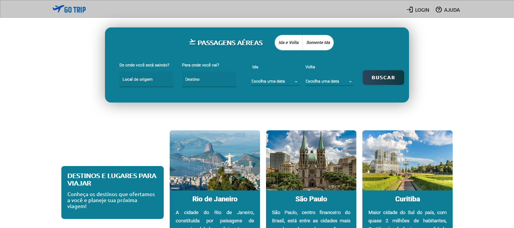

## Projeto goTrip
Site de passagens aéreas - Projeto desenvolvido na disciplina de desenvolvimento de software visual.

## Integrantes
Gabriel Ferraro Severino 
Athos Matovani

## Iniciar projeto

- Acessar o folder APIs e rodar o comando "npm start"
- Acessar o folder webServer e rodar "npm start"
- Acessar e rodar APIs/database/carregarDB - para gerar dados de mock

### Portas
- Servidor de APIs: 3000
- Servidor Angular: 4200
- BD: 27017

### Sobre o projeto
O projeto simula o funcionamento de um site de passagens aéreas; para comprar uma passagem aérea é necessário fazer login (se autenticar); é possível se autenticar como usuário ou administrador, administradores tem autorização para acessar a página de controle manipular os dados persistidos.

## Demonstração

### Homepage

### Buscando por passagens

### Página de login

### Conteúdos

- SPA desenvolvida em Angular
- API rest em Node
- Base de dados MongoDB
- Autenticação JWT
